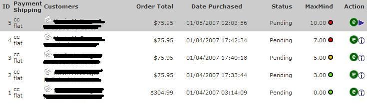

ZenCartMaxMindMinFraud
======================

ZenCart MaxMind minFraud (e-Commerce Fraud Detection)

MaxMind Credit Card Fraud Detection v1.4 for ZenCart 

<u>Overview</u> 
1. This has been tested on ZenCart 1.3.9h, your mileage on earlier versions may vary. 
2. This addon will allow the store owner to query the MaxMind server to identify and place a risk score on transactions. 
3. You MUST have an account with MaxMind to use this addon! You may get a test license with 1000 queries at: 
<a href="http://www.maxmind.com/app/ccv2r_signup?rId=k3live">http://www.maxmind.com/app/ccv2r_signup</a>

4. From MaxMind <a href="http://www.maxmind.com/app/ccv_overview?rId=k3live">website</a>: 
  <strong>Fraudster techniques becoming more   advanced</strong> 
Techniques used in online card-not-present fraud are becoming   more and more sophisticated. Traditional fraud screening tools can only   determine if a credit card is legitimate or if the user-entered account   information matches those on record. Today, fraudsters can obtain personal   credit card information, pose as the legitimate card holder, and bypass standard   fraud checks. 

<strong>Looking at fraud from a different angle</strong> 
At   MaxMind, we approach fraud screening in a different way. We examine an online   transaction from various angles. Our tools are not geared towards verifying the   authenticity of the credit card details used for the purchase, but rather,   identifying if the purchaser is the legitimate card holder. Through our   analysis, we have been able to identify traits and patterns that are associated   with fraudulent orders. By asking the right questions, we can provide e-commerce   businesses with the necessary information to detect fraudulent orders before the   payment is processed. 

5. This is what you should see once installed: 

  
   

<u>License 
</u>This code is licensed  under the terms of the GNU Public License(GPL).

<u>Warning</u> 
BACKUP your database and files BEFORE installation. Use this contribution at YOUR OWN RISK.

<u>Installation</u> 
With Zen Magic only one file needs to be replaced IF you want credit card orders to auto-process when the order is placed: 
includes/modules/pages/checkout_process/header.php

If you want to use the credit card issuer (BIN) name and phone number fraud scoring, or if you use the default credit card module and do not store credit card numbers on the server (you e-mail the middle numbers), you will need to replace: 
  includes/modules/payment/cc.php 
(This needs to be done to change which numbers stay on the server and which get e-mailed to you, we need the first 6 numbers to pass on to MaxMind)

If you use GoogleCheckout you need to replace: 
  googlecheckout/responsehandler.php 
(This needs to be done so the ip address is collected from the GoogleCheckout message and stored in the database.)

The core file includes/classes/order.php has to be modified to seperate the customers ip address.  
  (A regex smart person could rewrite the ip address grabbing code to remove this requirement.) 

All other files are added and used with Zen Magic: 
  admin/maxmind_orders.php 
admin/maxmind_update.php 
admin/images/flags/*.*
 
admin/includes/boxes/extra_boxes/maxmind_orders_customers_dhtml.php 
admin/includes/extra_datafiles/maxmind_orders.php 
admin/includes/languages/english/extra_definitions/maxmind_orders.php 
googlecheckout/responsehandler.php ***Only needed if you use GoogleCheckout*** 
images/maxmind_ccfd.gif 
includes/extra_datafiles/maxmind_orders.php 
includes/languages/english/extra_definitions/maxmind_orders.php 
  includes/modules/maxmind/CreditCardFraudDetection.php 
  includes/modules/maxmind/GeoIP.dat 
  includes/modules/maxmind/geoip.inc 
  includes/modules/maxmind/HTTPBase.php 
  includes/modules/maxmind/maxmind.php 
  includes/modules/payment/cc.php ***Read note above, only needed if you want to use BIN scoring or e-mail partial credit card numbers***  
includes/modules/pages/checkout_process/header.php ***Read note above, only needed if you want to auto-process orders*** 

Once you have uploaded the required files you need to add the new database fields: 
Go to Your Store -&gt; Admin -&gt; Tools -&gt; Install SQL Patches 
  Browse and upload maxmind_orders.sql

Make sure you have your MaxMind License Key (available from <a href="http://www.maxmind.com/app/ccv_overview?rId=k3live">http://www.maxmind.com/app/ccv2r_signup</a>): 
Go to Your Store -&gt; Admin -&gt; Configuration -&gt; My Store  
Find MaxMind License Key and update it with your license key. 

<u>Upgrading</u> 
Replace all files. 
  Go to Your Store -&gt; Admin -&gt; Tools -&gt; Install SQL Patches 
Browse and upload maxmind_orders_1.1-1.2.sql

<u>Change Notes 1.3.1 - 1.4</u> 
1. Updated core files for ZC 1.3.9h 
2. Updated GeoIP API 
3. Updated GeoIP Data to January 2011
 
4. Updated MaxMind API to 1.49

<u>Change Notes 1.3 - 1.3.1</u> 
  1. User_agent and accept_language cleanup (not yet implemented). 
2. ClientAPI cleanup.

<u>Change Notes 1.2 - 1.3</u> 
  1. MaxMind API Version Updated to 1.48 (Adds support for user_agent and accept_language). 
  2. Updated core files for ZC 1.3.8a. 
  3. Updated GoogleCheckout to 1.4.7. 

<u>Change Notes 1.1 - 1.2</u> 
1. Fixed delivery city not being passed for processing. 
2. Fixed delivery state not being passed for processing. 
3. Now compatible with GoogleCheckout (Check to see if state &amp; country are already zone id's, store ip address). 
4. Implemented new scoring (0-100 vs 0-10). 
5. Implemented new score explanation. 
6. Now includes checkout definitions for BIN name and phone on order page. 
7. Manual update now shows what information is being sent out for processing. 
8. Manual update query type selectable link (basic, standard, premium). 
9. Manual delete now uses messageStack for success message. 
10. Credit card checkout now has language file for bin name and phone. 

<u>Change Notes 1.0 - 1.1</u> 
  1. MaxMind API Version Updated to 1.43 (Adds support for username and password input fields). 
2. Corrected Standard and Premium services fields. 
3. Added link to MaxMind ID field to view input/ouput in MaxMind Support Log. 
4. Removed spam score, now integrated in returned proxy score. 
5. Implemented BIN name and phone in credit card module. 
6. Implemented score inaccuracy reporting, currently supports feedback for scores 1,3, &amp; 5. 
7. Fixed fraud score on order_edit page, no longer rounded. 

<u>To-Do List </u> 
1. Implement new observer class notifier and remove modifications to checkout_success.php. 
2. Implement minFraud alert handling. (<a onclick="return top.js.OpenExtLink(window,event,this)" href="http://www.maxmind.com/app/alert_url?rId=k3live" target="_blank">http://www.maxmind.com/app/alert_url</a>)  
3. Implement order status change for score threshold. 
4. Consider adding user_agent and accept_language to query. 
5. JS check BIN name and phone format. 
6. Consider modifying PayPal DP to record required details to analyze order. 
7. Continue to harass Ajeh for putting starting and ending IP address in same field. 

<u>Bug Reports</u> 
Please PM me on the ZenCart forum with any bug reports 
<a href="http://www.zen-cart.com/forum/private.php?do=newpm&amp;u=338">Quick PM Link</a>

<u>Support</u> 
Visit the <a href="http://www.zen-cart.com/forum/showthread.php?t=55599">ZenCart forum board</a> to read the latest and get support. 
  If you cannot find your answer there, <a href="http://www.zen-cart.com/forum/private.php?do=newpm&amp;u=338">PM me</a>. 

<u>FAQs</u> 
Q. When I run a manual update I see the correct information on the update page but the information is not displayed on the main order page. 
A. You probably already ran a manual update for that order and an entry in the db already exists. Hit the 'Delete MaxMind Information' link and then run another manual update. 
   
  Q. This contribution doesn't work! 
A. It works for me :)

Q. Can you do it for me? 
  A. I will help out as much as I can on the ZenCart forum board, beyond that if you PM me expect to hire me.

Q. How can I contribute to the author? 
A. Please direct all contributions to the <a href="http://www.zen-cart.com/index.php?main_page=infopages&amp;pages_id=14">ZenCart Team</a>

Q. Why is the readme in HTML? 
  A. I like HTML, get over it :)

Last modified January 25th, 2011 
  Kevin M.  
  ses707

